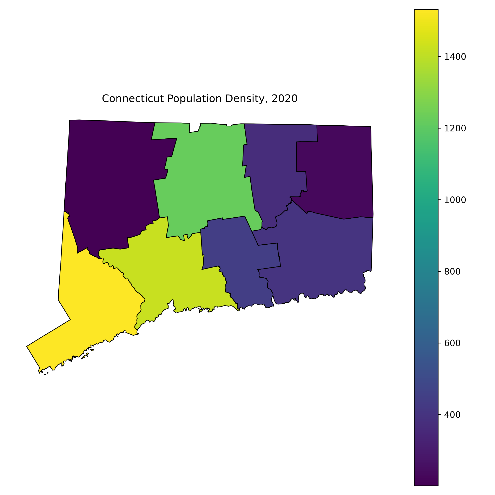

# Introduction to Geospatial Analysis

Geospatial analysis is the process of using location and geographic information to understand patterns, relationships, and changes across space.

It can help us answer questions like:

- Where are people, places, or events located?
- How are things distributed geographically?
- What patterns emerge when we look at data spatially?

# Why Use Python for Geospatial Analysis?

GIS software such as ArcGIS Pro can already do many types of spatial analysis.

Python offers some additional advantages:

- Automating repetitive tasks
- Working with large datasets
- Connecting geospatial analysis with other data science tools
- Creating analyses that can be repeated with code

**Python and GIS software can be complementary tools.**

# Python and the Geospatial Workflow

Python can be used throughout the data analysis process:

1. **Find and import data**
2. **Clean and organize data**
3. **Analyze spatial relationships**
4. **Create maps and visualizations**
5. **Export or share the results**
This makes it possible to connect multiple steps of an analysis in one workflow.

# Why Does Reproducibility Matter?

One advantage of using code is that the steps of an analysis are written down.

For example:

python
data = load_data()

data = clean_data(data)

result = analyze(data)

make_map(result)

# Where does Spatial Data Come From?
There are many sources of geographic data, including: 

- **Esri / ArcGIS** — maps, geographic boundaries, and many public datasets
- **U.S. Census Bureau** — population, housing, demographic, and geographic data
- **NOAA** — weather, climate, ocean, and environmental data
- **USGS** — elevation, land use, water, and geological data
- **OpenStreetMap** — roads, buildings, businesses, and other geographic features
- **State and local governments** — transportation, planning, environmental, and public-service data

# What Formats Can Spatial Data Have?

Spatial data can be stored in several different formats

- **Vector** 

- **Raster**

- **Tabular**
    

# Vector data

Represents individual geographic features:

- Shapefile
- GeoJSON
- GeoPackage
- KML

Examples: counties, roads, buildings, rivers, and cities.

# Raster data

Represents geographic information as a grid of cells.

Examples:

- Satellite imagery
- Elevation data
- Temperature
- Land cover

# Tabular data

Traditional datasets can also contain geographic information.

Examples:

- CSV
- Excel
- Database tables

A table can be combined with geographic boundaries using a shared variable such as a county or state name.

# How Does Python Use Spatial Data?

Python has libraries that allow us to read, manipulate, analyze, and visualize spatial data.

For example, **GeoPandas** can read a geographic file:

python
import geopandas as gpd

counties = gpd.read_file("counties.geojson")

# Types of Maps

Different maps are useful for answering different questions.

- **Choropleth maps** — use color to show values across areas
- **Point maps** — show the locations of individual features
- **Proportional symbol maps** — use symbol size to represent values
- **Heat maps** — show concentrations or density
- **Flow maps** — show movement between locations

# Choosing the Right Map

The type of map should match the question we are asking.

- Where are things located? → **Point map**
- How does a value vary across areas? → **Choropleth**
- Where are things concentrated? → **Heat map**
- How large are different values? → **Proportional symbols**
- How do people or goods move? → **Flow map**

There is no single "best" map for every dataset.

# What Makes a Good Map?

A useful map should make the underlying pattern easy to see.

Important considerations include:

- Choosing an appropriate map type
- Using a clear legend
- Choosing meaningful categories or scales
- Providing context and labels
- Avoiding unnecessary visual elements

The map should help answer a specific question.

# Example: Population Density in Connecticut
**Question:**
**How is population distributed across Connecticut?**

We can combine:

- Geographic boundaries
- Population data
- Land area

To create a **choropleth map** to answer our question.

# Connecticut Population Density

{width=75%}

*2020 Census data; population density is people per square mile.*

# How I Made the Map

1. Downloaded 2020 county boundaries from the **U.S. Census**
2. Added 2020 population and land-area data
3. Calculated population density
4. Used **GeoPandas** to create a choropleth map

**Population density = population ÷ land area**

# GeoPandas

**GeoPandas** extends pandas to work with geographic data.

It allows us to:

- Read spatial files
- Store geographic features in GeoDataFrames
- Filter and combine spatial data
- Perform spatial operations
- Create maps

For this example, GeoPandas handled the county boundaries and map creation.

# GeoDataFrames

A **GeoDataFrame** combines traditional tabular data with geographic information.

For example:

| County | Population | Geometry |
|---|---:|---|
| Fairfield | 957,419 | County boundary |
| Hartford | 899,498 | County boundary |
| New Haven | 864,835 | County boundary |

The geometry tells Python **where** the data belongs.

# Python and GIS Software

Python does not have to replace traditional GIS software.

**GIS software**

- Interactive mapping
- Visual editing
- Spatial analysis tools
- Easy visual exploration

**Python**

- Automation
- Reproducible workflows
- Data processing
- Integration with other data-science tools

The two approaches can complement each other.

# Key Takeaways

- Spatial data connects **information with location**
- Python can work with many geographic data sources and formats
- **GeoPandas** brings geospatial analysis into the Python data-science workflow
- Different questions require different types of maps
- Code can make spatial analysis **repeatable and reproducible**

Python is one tool among many for working with spatial data.

# References and AI Disclosure 
I used Chat GPT Version Luna 5.6 (Free version), to help me 
with the coding aspect of the map making, as well as to advise on slides 
and file organization. 

**References**
https://medium.com/data-science/visualizing-geospatial-data-in-python-e070374fe621
https://geopandas.org/en/stable/

